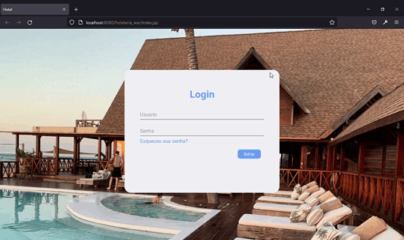
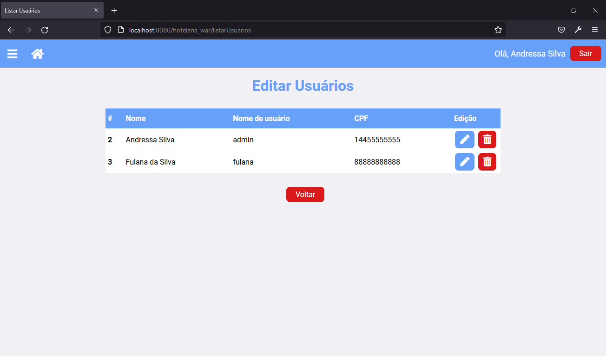
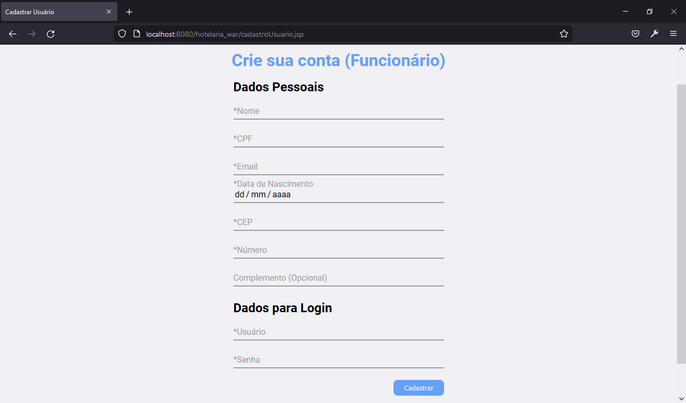
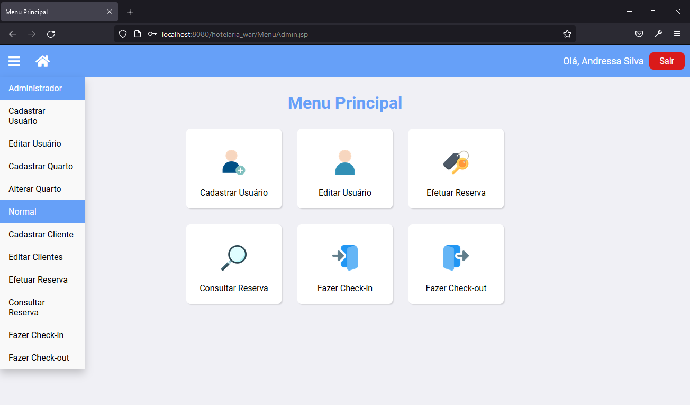
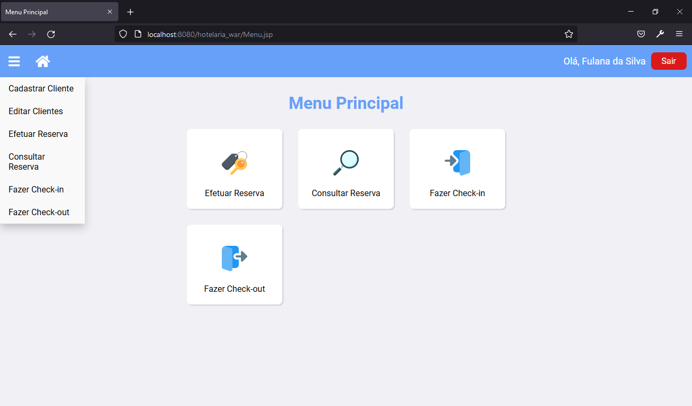
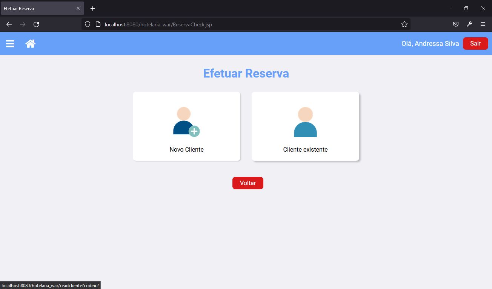
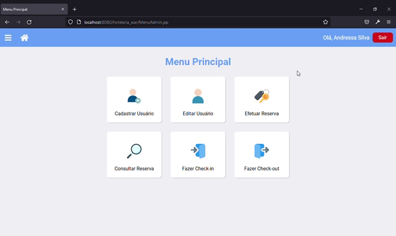

# Hotelaria (Em desenvolvimento)

## Funcionalidades

- Da aplicação
- [x] CRUD de Clientes, Usuários, Quartos e Reservas
- [x] Login e Session
- [x] Controle de acesso por priviégios (Admin e Funcionário)
- [x] Design agradável
- [x] Controle de Reserva
- [x] Check-in e Check-out
- [x] Mecanismo de Busca

- Skills trabalhadas
- [x] REST Api
- [x] Padrão MVC
- [x] Java para Web
- [x] Estilização por CSS
- [x] JDBC e MySQL

## Prints e Gifs

- Login

- Controle de Acesso

Usuários cadastrados no sistema (acessados somente pelo admin)

Menu do Admin

Menu do Funcionário

- Reserva

Menu de Reserva

## Projeto desenvolvido por

* [Andressa Silva](https://github.com/auroradark)
* [Fillipe Gonçalves](https://github.com/Fillipe-GC)
* [Lucas Nadier](https://github.com/lucasnad)

  

